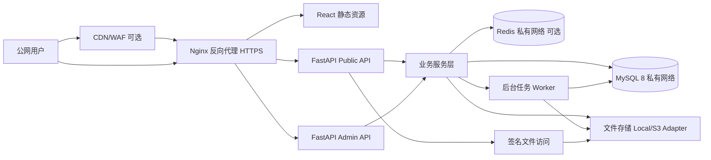

# 个人博客系统项目计划书

版本：v0.1.0  
日期：2026-06-15  
技术约束：后端 Python + FastAPI + uv，前端 React + npm，数据库 MySQL，支持文件管理、友链、小网站跳转、后台管理。开发环境为 Windows 11，生产部署环境为 Linux Debian。界面文案、说明文字、代码注释、README 和项目文档默认使用中文。

本地开发服务避免使用常见端口：前端默认 `15173`，后端默认 `18080`。避免使用 `3000`、`5173`、`8000` 等容易与其他工具或框架冲突的端口。后端本地启动必须在 `backend` 目录使用 `uv run python main.py`，不要直接使用系统 Python 或全局 Python。端口、域名、数据库连接、CORS、Trusted Host、上传目录、API 地址等环境相关配置必须放在独立配置文件或环境变量中，不得硬编码在业务代码或启动脚本里。联调或验证完成后必须关闭本次启动的本项目服务，并确认相关端口不再监听。

## 1. 项目定位

本项目目标是建设一个自托管的个人博客与轻量 CMS 系统，既能写文章，也能管理图片、附件、友链、导航站点和后台配置。系统优先满足个人长期维护、可迁移、可扩展、数据可控，而不是一开始就做成大型多租户平台。

公网部署是默认设计目标。系统从第一天就按照可暴露在互联网的生产服务来规划，后端、数据库、缓存和文件原始存储默认不直接暴露公网，所有公网流量统一经过反向代理、HTTPS、限流和安全响应头。

核心目标：

- 文章发布：Markdown 写作、LaTeX 公式、草稿、发布、定时发布、标签、分类、SEO 信息。
- 页面管理：关于、归档、项目页等独立页面。
- 文件管理：图片、附件上传、分类、引用追踪、本地存储，后续可扩展对象存储。
- 友链管理：友链申请、审核、排序、头像、描述、状态检查。
- 小网站跳转：类似个人导航页，按分组管理常用站点或自建小服务入口。
- 后台管理：登录、角色权限、内容管理、文件管理、站点配置、操作日志。
- 开放接口：前台公开 API 与后台管理 API 分离。

非目标：

- v1 不做多租户 SaaS。
- v1 不做复杂电商、会员订阅、付费文章。
- v1 不强依赖插件市场，但保留模块化扩展边界。

## 2. 开源项目参考

参考对象选择仍然活跃、架构思路较新的开源博客/CMS，而不是只参考早期传统博客系统。

| 项目 | 技术栈 | 可借鉴点 | 本项目取舍 |
| --- | --- | --- | --- |
| Halo 2.x | Java/Kotlin, Vue | 博客/CMS 一体化、主题、附件、友链、插件化 | 借鉴内容模型、附件与友链体验，不复制重插件体系 |
| Payload CMS 3.x | TypeScript, React | Collection 驱动后台、React 管理端、文件上传、权限 | 借鉴“数据集合 + 自动化后台表单”的设计思想 |
| Strapi 5 | Node.js, React | Headless CMS、媒体库、RBAC、内容类型 | 借鉴 API first、媒体库、权限模型 |
| Directus 11 | Node.js, Vue | 数据库优先、权限、审计、文件管理 | 借鉴审计日志、字段级治理思路 |
| Ghost 5 | Node.js | 发布流程、标签、slug、SEO、RSS | 借鉴内容发布体验和公开站点 SEO 结构 |

设计结论：

- 前后台分离，后端提供 REST API。
- 前台博客和后台管理都用 React，但路由、权限、接口客户端分开。
- 数据模型优先，避免把业务逻辑埋在前端。
- 文件管理作为一等模块设计，不把上传文件简单散落在目录里。
- 友链和导航跳转作为独立业务模块，而不是硬编码在配置文件中。

## 3. 总体架构



公网架构原则：

- 只开放 `80` 和 `443` 到公网，`80` 强制跳转 `443`。
- 后端、MySQL、Redis、任务队列、原始上传目录均运行在私有网络内。
- 后台管理端可以使用独立路径 `/admin` 或独立域名 `admin.example.com`，并支持 IP allowlist 或额外二次验证。
- Nginx 负责 TLS、静态资源、API 反向代理、请求体大小限制、基础限流和安全响应头；上传文件不挂载为静态目录，公开访问由后端签名接口授权。
- FastAPI 只信任反向代理传递的真实 IP，严格配置 `TrustedHost`、CORS 和代理头。
- 文件、数据库、密钥、备份都按生产环境处理，不把容器内部临时数据当作持久数据。

### 3.1 后端分层

后端采用 FastAPI + SQLAlchemy 2.x + Alembic：

```text
backend/
  pyproject.toml
  uv.lock
  app/
    main.py
    api/
      dependencies.py
      encrypted_response.py
      limits.py
      public/
        common.py
        posts.py
        taxonomy.py
        settings.py
        links.py
        files.py
      admin/
    core/
      config.py
      security.py
      database.py
      storage.py
    models/
    schemas/
    services/
      file_errors.py
      file_storage.py
      file_tokens.py
      file_uploads.py
    repositories/
    tasks/
  migrations/
  tests/
```

分层说明：

- `api`：只处理 HTTP 请求、响应、依赖注入和权限校验。`api/dependencies.py`、`api/encrypted_response.py` 和 `api/limits.py` 放置公开端与后台端共享的服务依赖、加密信封和限流入口；`api/admin` 只保留后台认证、CSRF、权限和后台路由，`api/public` 不反向依赖后台模块。公开 API 按职责拆为 `posts.py`、`taxonomy.py`、`settings.py`、`links.py`、`files.py`，`router.py` 只负责聚合子路由和公开状态接口。
- `schemas`：Pydantic v2 请求与响应模型。
- `services`：业务规则，例如文章发布、文件引用、友链审核；文件模块中 `files.py` 只保留用例编排，上传校验、存储路径/缩略图、临时 token/文章图片 URL 签名和异常类型分别拆到 `file_uploads.py`、`file_storage.py`、`file_tokens.py` 和 `file_errors.py`。
- `repositories`：数据库读写封装，基于 SQLAlchemy。
- `models`：MySQL 表模型。
- `core`：配置、认证、数据库、存储驱动、日志等基础设施。
- `tasks`：缩略图、链接检查、站点地图生成等异步任务。

### 3.2 前端分层

前端采用 React + TypeScript + Vite + npm：

```text
frontend/
  package.json
  src/
    app/
    routes/
      public/
      admin/
    components/
    features/
      posts/
      files/
      links/
      sites/
      settings/
    api/
    stores/
    styles/      # 全局样式分层，index.css 只负责聚合导入
```

建议依赖：

- 构建：Vite。
- 路由：React Router。
- 请求缓存：TanStack Query。
- 表单：React Hook Form + Zod。
- UI：前台以 Innei/Yohaku 设计系统为视觉基线，使用 `@yohaku/design-system` 的 token 契约并在当前 Vite CSS 中镜像运行时变量；后台沿用同一套中性色、细边框和低对比层级，后续如需密集表单可再评估 Ant Design 或 shadcn/ui。
- Markdown 编辑器：`@uiw/react-md-editor` 或 `md-editor-rt`。
- Markdown/LaTeX 渲染：文章正文支持行内公式 `$...$` 和块级公式 `$$...$$`，可选 `remark-math` + `rehype-katex` 或同类可替换实现。

前台重点是阅读体验、归档、搜索、RSS、SEO。后台重点是密集管理界面，强调表格、筛选、批量操作、状态流转。

### 3.3 解耦与设计模式

系统按“高内聚、低耦合、可替换实现”设计。业务代码不直接依赖 FastAPI 路由、数据库会话、文件系统或第三方 SDK，而是通过服务层、仓储层和接口协议隔离变化。

后端面向对象边界：

- `Service`：承载业务用例，例如 `PostService.publish()`、`FileService.attach_usage()`。
- `Repository`：承载数据访问，例如 `PostRepository`、`FileRepository`，避免 SQL 散落在业务代码中。
- `StorageProvider`：文件存储接口，本地存储、S3、OSS、MinIO 都作为不同实现。
- `Policy`：权限和发布规则，例如 `PostPolicy.can_publish()`。
- `Event`：领域事件，例如 `PostPublished`、`FileUploaded`，用于解耦通知、缓存刷新、站点地图生成。
- `Task`：后台任务只消费明确输入，不直接读写路由上下文。

推荐设计模式：

| 模式 | 使用位置 | 目的 |
| --- | --- | --- |
| Repository | 数据访问层 | 隔离 ORM 和业务逻辑 |
| Service Layer | 业务用例层 | 保持 API 层轻量 |
| Strategy | 文件存储、Markdown/LaTeX 渲染、搜索实现 | 支持替换实现 |
| Factory | 存储驱动、认证提供方初始化 | 统一创建复杂对象 |
| Policy | RBAC 权限、内容发布规则 | 避免权限判断散落 |
| Observer/Event | 发布后刷新缓存、生成 sitemap、记录审计 | 降低模块耦合 |
| Adapter | 对象存储、邮件、第三方登录 | 隔离外部服务 SDK |

前端解耦边界：

- `features/*` 按业务模块组织，每个模块包含页面、组件、hooks、API 封装。
- `api/*` 只处理请求客户端和 DTO，不直接混入 UI 状态。
- 表单 schema、接口类型、展示组件分离，避免一个页面文件同时承担请求、校验、布局和状态管理。
- 后台管理组件优先做可复用表格、筛选器、上传器、状态标签，但不提前抽象过度通用的“万能组件”。

单文件体量约束：

- 普通源码文件建议控制在 300 行以内。
- React 页面或复杂服务文件超过 400 行必须评估拆分。
- 单个函数建议控制在 60 行以内；超过时优先拆成私有方法、策略类或独立 helper。
- 一个文件只承担一个主要职责；若同时出现路由、数据库、权限、业务规则和外部 SDK 调用，必须重构。
- 数据表设计、计划书可以较长，但实现代码不能用“大文件”堆功能。

重构触发条件：

- 同类逻辑复制 3 次以上。
- 文件持续增长且难以定位职责。
- 新增功能需要修改多个无关模块才能完成。
- 单元测试难写，需要大量 mock 内部细节。
- 安全、权限、存储、日志等横切逻辑散落在业务代码中。

### 3.4 公网部署结构

v1 推荐单机公网部署，使用 Docker Compose 组织服务。后续访问量增长时，可平滑拆分到独立数据库、对象存储和 CDN。

```text
deploy/
  docker-compose.yml
  docker-compose.prod.yml
  nginx/
    nginx.conf
    conf.d/
  certs/
  env/
    backend.env.example
    mysql.env.example
  scripts/
    backup_mysql.sh
    restore_mysql.sh
    renew_cert.sh
```

服务：

- `nginx`：唯一公网入口，暴露 `80:80`、`443:443`。
- `backend`：FastAPI + Uvicorn/Gunicorn，只在 Docker 内网暴露端口。
- `worker`：后台任务，处理缩略图、站点地图、链接检查、文件清理。
- `mysql`：MySQL 8.x，只绑定 Docker 内网，不映射公网端口。
- `redis`：可选，只在 Docker 内网使用，用于缓存、任务队列、限流。
- `frontend`：React 构建产物，由 Nginx 以静态文件方式提供。
- `storage`：宿主持久目录，例如 `/data/blog/uploads`、`/data/blog/backups`。

### 3.5 网络与域名规划

推荐域名：

| 用途 | 示例 | 说明 |
| --- | --- | --- |
| 前台博客 | `https://example.com` | 访客访问入口 |
| 后台管理 | `https://example.com/admin` 或 `https://admin.example.com` | 管理入口，建议增加额外保护 |
| 公开文件下载 | `https://example.com/api/public/files/{id}/download?token=...` | 使用短时签名 URL |
| 文章图片渲染 | `https://example.com/api/public/posts/{slug}/files/{file_id}/render?expires=...&token=...` | 后端校验文章引用关系后返回图片 |
| API | `https://example.com/api/...` | 由 Nginx 反代到 FastAPI |

端口与网络：

- 公网安全组只放行 `80/tcp`、`443/tcp`，SSH 端口仅允许固定 IP 或使用堡垒机/VPN。
- MySQL 不开放 `3306` 到公网，Redis 不开放 `6379` 到公网。
- Docker Compose 使用独立网络，例如 `blog_public` 和 `blog_private`。只有 Nginx 同时连接 public/private，MySQL 只连接 private。
- 生产环境禁用 FastAPI docs 或仅在后台鉴权后访问 `/docs`。
- 前端生产构建必须先拆分第三方 vendor chunk 与项目源码 chunk；第三方依赖不混淆，包含 `src/` 项目源码的 JavaScript chunk 必须混淆，产物文件名使用纯 hash。后台登录页和鉴权入口保留在初始包，后台工作区页面与后台 CRUD 接口代码必须在登录校验通过后动态加载。构建完成后为文本型静态资源生成 `.gz` 预压缩文件，Nginx 使用 `gzip_static` 优先返回压缩资源。

### 3.6 配置与密钥

- 所有密钥通过 `.env` 或部署平台 Secret 注入，不提交真实密钥。
- 生产环境必须配置 `SECRET_KEY`、JWT 密钥、数据库密码、对象存储密钥、SMTP 密钥。
- `.env.example` 只保留示例值。
- 启动时校验关键配置，生产环境缺失强密钥则拒绝启动。
- 日志中禁止输出密码、Token、Cookie、数据库连接串、对象存储签名 URL、公开访问 query/token 参数、内容标题/slug、外部 URL、文件名、MIME 和完整设置值。
- 定期轮换后台密码、数据库密码、JWT 签名密钥和对象存储访问密钥。

## 4. 功能模块

### 4.1 文章模块

- Markdown 写作与预览。
- LaTeX 公式语法，支持行内公式和块级公式渲染。
- 草稿、已发布、定时发布、归档、删除。
- 分类、标签、封面图、摘要。
- 自定义 slug，生成永久链接。
- SEO 标题、描述、关键词、canonical URL。
- 文章修订历史，支持回滚。
- RSS、站点地图、归档页。

### 4.2 页面模块

- 独立页面：关于、项目、留言板等。
- 页面 slug 全局唯一。
- 页面可配置是否出现在导航菜单。

### 4.3 文件管理模块

- 上传图片、附件。
- 文件哈希去重。
- 图片宽高、MIME、大小、扩展名记录。
- 文件引用追踪，例如文章封面、正文图片、友链头像。
- 本地存储优先，预留 S3/MinIO/阿里云 OSS/七牛云适配。
- 后台支持列表、搜索、删除、替换、复制链接。

### 4.4 友链模块

- 友链名称、URL、头像、描述、RSS。
- 分组、排序、启用/停用。
- 申请状态：待审核、通过、拒绝。
- 可选链接健康检查：定期访问 URL，记录最后检查时间和状态码。

### 4.5 小网站跳转模块

用于做个人导航页或自建服务入口，例如工具站、项目 Demo、监控面板、文档站。

- 分组管理：开发工具、个人项目、常用站点、自建服务。
- 站点条目：名称、URL、图标、描述、标签、打开方式。
- 支持公开、隐藏、后台可见。
- 支持点击统计。

### 4.6 后台管理模块

- 账号登录、登出、刷新令牌。
- 角色权限：超级管理员、编辑、访客审核员等。
- 文章、页面、文件、友链、导航站点管理。
- 站点设置：标题、描述、备案号、头像、主题配置。
- 操作日志：记录关键后台动作。
- 登录日志：记录 IP、UA、登录结果。

## 5. API 设计

### 5.1 Public API

| 方法 | 路径 | 说明 |
| --- | --- | --- |
| POST | `/api/public/encryption/sessions` | 公开接口加密会话协商 |
| GET | `/api/public/posts` | 文章列表 |
| GET | `/api/public/posts/{slug}` | 文章详情 |
| GET | `/api/public/posts/{slug}/files/{file_id}/render` | 文章正文图片渲染 |
| GET | `/api/public/categories` | 公开分类列表，包含公开文章数量 |
| GET | `/api/public/categories/{slug}` | 公开分类详情，包含公开文章数量 |
| GET | `/api/public/tags` | 公开标签列表，包含公开文章数量 |
| GET | `/api/public/tags/{slug}` | 公开标签详情，包含公开文章数量 |
| GET | `/api/public/pages/{slug}` | 页面详情 |
| GET | `/api/public/friend-links` | 友链列表 |
| POST | `/api/public/friend-links/applications` | 提交友链申请 |
| GET | `/api/public/site-items` | 导航站点条目列表 |
| GET | `/api/public/site-items/{id}/visit` | 导航站点跳转与点击统计 |
| GET | `/api/public/files` | 公开文件栏列表 |
| GET | `/api/public/files/{id}/download` | 公开文件短时签名下载 |
| GET | `/api/public/settings/site-profile` | 公开站点资料 |
| GET | `/rss.xml` | RSS |
| GET | `/sitemap.xml` | 站点地图 |

### 5.2 Admin API

| 方法 | 路径 | 说明 |
| --- | --- | --- |
| POST | `/api/admin/auth/login` | 登录 |
| POST | `/api/admin/auth/refresh` | 刷新令牌 |
| POST | `/api/admin/auth/logout` | 退出登录 |
| GET | `/api/admin/auth/me` | 当前后台用户 |
| GET | `/api/admin/posts` | 后台文章列表 |
| POST | `/api/admin/posts` | 创建文章 |
| GET | `/api/admin/posts/{id}` | 后台文章详情 |
| PATCH | `/api/admin/posts/{id}` | 更新文章 |
| POST | `/api/admin/posts/{id}/publish` | 发布文章 |
| POST | `/api/admin/posts/preview` | 不落库渲染文章预览 |
| GET | `/api/admin/pages` | 后台页面列表 |
| POST | `/api/admin/pages` | 创建页面 |
| GET | `/api/admin/pages/{id}` | 后台页面详情 |
| PATCH | `/api/admin/pages/{id}` | 更新页面 |
| POST | `/api/admin/files` | 上传文件 |
| GET | `/api/admin/files` | 文件列表 |
| GET | `/api/admin/files/{id}/temporary-url` | 生成短时访问链接 |
| GET | `/api/admin/files/{id}/download` | 后台鉴权下载公开或私有文件 |
| GET | `/api/admin/files/{id}/preview` | 生成后台预览签名图片 |
| DELETE | `/api/admin/files/{id}` | 删除文件 |
| GET | `/api/admin/friend-link-groups` | 友链分组管理 |
| POST | `/api/admin/friend-link-groups` | 创建友链分组 |
| PATCH | `/api/admin/friend-link-groups/{id}` | 更新友链分组 |
| GET | `/api/admin/friend-links` | 友链管理 |
| POST | `/api/admin/friend-links` | 创建友链 |
| PATCH | `/api/admin/friend-links/{id}` | 更新友链 |
| PATCH | `/api/admin/friend-links/{id}/review` | 审核友链 |
| GET | `/api/admin/site-groups` | 小网站跳转分组管理 |
| POST | `/api/admin/site-groups` | 创建小网站跳转分组 |
| PATCH | `/api/admin/site-groups/{id}` | 更新小网站跳转分组 |
| GET | `/api/admin/site-items` | 小网站跳转条目管理 |
| POST | `/api/admin/site-items` | 创建小网站跳转条目 |
| PATCH | `/api/admin/site-items/{id}` | 更新小网站跳转条目 |
| GET | `/api/admin/settings` | 设置列表 |
| PATCH | `/api/admin/settings/{key}` | 修改设置 |
| GET | `/api/admin/audit-logs` | 操作日志 |
| GET | `/api/admin/access-logs` | 访问日志 |
| GET | `/api/admin/login-logs` | 后台登录日志 |
| GET | `/api/admin/security-events` | 安全事件日志 |

## 6. 数据库设计

统一约定：

- 数据库：MySQL 8.x。
- 字符集：`utf8mb4`。
- 时间字段：`DATETIME(6)`，统一存 UTC 或服务端约定时区。
- 主键：`BIGINT UNSIGNED AUTO_INCREMENT`。
- 软删除字段：需要回收站的表增加 `deleted_at`。
- JSON 字段：用于配置和扩展信息，不承载核心查询条件。

公网生产约束：

- MySQL 只允许后端容器或内网主机访问，不暴露公网端口。
- 应用使用独立数据库账号，只授予业务库所需权限，不使用 `root` 连接应用。
- 启用自动备份，至少保留每日备份 7 天、每周备份 4 周。
- 备份文件加密保存，并定期做恢复演练。
- 数据库迁移由 Alembic 管理，生产迁移前先备份。
- 所有包含 IP、UA、登录记录的表要设置合理保留周期，避免日志无限增长。

### 6.1 用户与权限

#### users

| 字段 | 类型 | 说明 |
| --- | --- | --- |
| id | BIGINT UNSIGNED | 主键 |
| username | VARCHAR(64) | 用户名，唯一 |
| email | VARCHAR(255) | 邮箱，唯一 |
| password_hash | VARCHAR(255) | 密码哈希 |
| display_name | VARCHAR(64) | 展示名 |
| avatar_file_id | BIGINT UNSIGNED | 头像文件 |
| status | TINYINT | 1 正常，0 禁用 |
| last_login_at | DATETIME(6) | 最后登录时间 |
| created_at | DATETIME(6) | 创建时间 |
| updated_at | DATETIME(6) | 更新时间 |

#### roles

| 字段 | 类型 | 说明 |
| --- | --- | --- |
| id | BIGINT UNSIGNED | 主键 |
| code | VARCHAR(64) | 角色编码，唯一 |
| name | VARCHAR(64) | 角色名称 |
| description | VARCHAR(255) | 描述 |
| created_at | DATETIME(6) | 创建时间 |

#### permissions

| 字段 | 类型 | 说明 |
| --- | --- | --- |
| id | BIGINT UNSIGNED | 主键 |
| code | VARCHAR(128) | 权限编码，唯一，例如 `post:write` |
| name | VARCHAR(64) | 权限名称 |
| group_name | VARCHAR(64) | 权限分组 |

#### user_roles

| 字段 | 类型 | 说明 |
| --- | --- | --- |
| user_id | BIGINT UNSIGNED | 用户 ID |
| role_id | BIGINT UNSIGNED | 角色 ID |

#### role_permissions

| 字段 | 类型 | 说明 |
| --- | --- | --- |
| role_id | BIGINT UNSIGNED | 角色 ID |
| permission_id | BIGINT UNSIGNED | 权限 ID |

#### refresh_tokens

| 字段 | 类型 | 说明 |
| --- | --- | --- |
| id | BIGINT UNSIGNED | 主键 |
| user_id | BIGINT UNSIGNED | 用户 ID |
| token_hash | CHAR(64) | Refresh Token 哈希 |
| expires_at | DATETIME(6) | 过期时间 |
| revoked_at | DATETIME(6) | 吊销时间 |
| created_at | DATETIME(6) | 创建时间 |

### 6.2 内容模型

#### posts

| 字段 | 类型 | 说明 |
| --- | --- | --- |
| id | BIGINT UNSIGNED | 主键 |
| title | VARCHAR(200) | 标题 |
| slug | VARCHAR(220) | URL slug，唯一 |
| summary | VARCHAR(500) | 摘要 |
| content_md | LONGTEXT | Markdown 原文，允许包含 LaTeX 公式语法 |
| content_html | LONGTEXT | Markdown 与 LaTeX 渲染后的 HTML |
| cover_file_id | BIGINT UNSIGNED | 封面图 |
| author_id | BIGINT UNSIGNED | 作者 |
| status | VARCHAR(32) | draft, published, scheduled, archived |
| visibility | VARCHAR(32) | public, hidden, private |
| allow_comment | TINYINT | 是否允许评论 |
| pinned | TINYINT | 是否置顶 |
| view_count | BIGINT UNSIGNED | 浏览数 |
| word_count | INT UNSIGNED | 字数 |
| seo_title | VARCHAR(255) | SEO 标题 |
| seo_description | VARCHAR(500) | SEO 描述 |
| seo_keywords | VARCHAR(500) | SEO 关键词 |
| published_at | DATETIME(6) | 发布时间 |
| created_at | DATETIME(6) | 创建时间 |
| updated_at | DATETIME(6) | 更新时间 |
| deleted_at | DATETIME(6) | 软删除时间 |

索引建议：

- 唯一索引：`uk_posts_slug(slug)`。
- 普通索引：`idx_posts_status_published(status, published_at)`。
- 普通索引：`idx_posts_author(author_id)`。

#### post_revisions

| 字段 | 类型 | 说明 |
| --- | --- | --- |
| id | BIGINT UNSIGNED | 主键 |
| post_id | BIGINT UNSIGNED | 文章 ID |
| version | INT UNSIGNED | 版本号 |
| title | VARCHAR(200) | 标题快照 |
| content_md | LONGTEXT | Markdown 与 LaTeX 原文快照 |
| editor_id | BIGINT UNSIGNED | 编辑者 |
| created_at | DATETIME(6) | 创建时间 |

#### categories

| 字段 | 类型 | 说明 |
| --- | --- | --- |
| id | BIGINT UNSIGNED | 主键 |
| parent_id | BIGINT UNSIGNED | 父分类 |
| name | VARCHAR(64) | 分类名称 |
| slug | VARCHAR(80) | slug，唯一 |
| description | VARCHAR(255) | 描述 |
| sort_order | INT | 排序 |
| created_at | DATETIME(6) | 创建时间 |

#### tags

| 字段 | 类型 | 说明 |
| --- | --- | --- |
| id | BIGINT UNSIGNED | 主键 |
| name | VARCHAR(64) | 标签名 |
| slug | VARCHAR(80) | slug，唯一 |
| color | VARCHAR(32) | 颜色 |
| created_at | DATETIME(6) | 创建时间 |

#### post_categories

| 字段 | 类型 | 说明 |
| --- | --- | --- |
| post_id | BIGINT UNSIGNED | 文章 ID |
| category_id | BIGINT UNSIGNED | 分类 ID |

#### post_tags

| 字段 | 类型 | 说明 |
| --- | --- | --- |
| post_id | BIGINT UNSIGNED | 文章 ID |
| tag_id | BIGINT UNSIGNED | 标签 ID |

#### pages

| 字段 | 类型 | 说明 |
| --- | --- | --- |
| id | BIGINT UNSIGNED | 主键 |
| title | VARCHAR(200) | 页面标题 |
| slug | VARCHAR(220) | URL slug，唯一 |
| content_md | LONGTEXT | Markdown 原文，允许复用 LaTeX 公式语法 |
| content_html | LONGTEXT | Markdown 与 LaTeX 渲染后的 HTML |
| status | VARCHAR(32) | draft, published, hidden |
| show_in_nav | TINYINT | 是否显示在导航 |
| sort_order | INT | 排序 |
| seo_title | VARCHAR(255) | SEO 标题 |
| seo_description | VARCHAR(500) | SEO 描述 |
| created_at | DATETIME(6) | 创建时间 |
| updated_at | DATETIME(6) | 更新时间 |
| deleted_at | DATETIME(6) | 软删除时间 |

### 6.3 文件管理

#### files

| 字段 | 类型 | 说明 |
| --- | --- | --- |
| id | BIGINT UNSIGNED | 主键 |
| storage | VARCHAR(32) | local, s3, oss 等 |
| bucket | VARCHAR(128) | 存储桶，可为空 |
| object_key | VARCHAR(500) | 存储路径或对象 key |
| public_url | VARCHAR(1000) | 公开访问 URL |
| original_name | VARCHAR(255) | 原始文件名 |
| mime_type | VARCHAR(128) | MIME 类型 |
| extension | VARCHAR(32) | 扩展名 |
| size_bytes | BIGINT UNSIGNED | 文件大小 |
| sha256 | CHAR(64) | 哈希 |
| width | INT UNSIGNED | 图片宽度 |
| height | INT UNSIGNED | 图片高度 |
| alt_text | VARCHAR(255) | 替代文本 |
| uploader_id | BIGINT UNSIGNED | 上传者 |
| visibility | VARCHAR(32) | public, private |
| status | VARCHAR(32) | active, orphaned, deleted |
| created_at | DATETIME(6) | 创建时间 |
| updated_at | DATETIME(6) | 更新时间 |
| deleted_at | DATETIME(6) | 软删除时间 |

索引建议：

- 唯一索引：`uk_files_sha256(sha256)`。
- 普通索引：`idx_files_uploader(uploader_id)`。
- 普通索引：`idx_files_mime(mime_type)`。

#### file_usages

| 字段 | 类型 | 说明 |
| --- | --- | --- |
| id | BIGINT UNSIGNED | 主键 |
| file_id | BIGINT UNSIGNED | 文件 ID |
| entity_type | VARCHAR(64) | post, page, friend_link, site_item |
| entity_id | BIGINT UNSIGNED | 业务实体 ID |
| purpose | VARCHAR(64) | cover, post_body, avatar, icon, attachment |
| created_at | DATETIME(6) | 创建时间 |

### 6.4 友链与小网站跳转

#### friend_link_groups

| 字段 | 类型 | 说明 |
| --- | --- | --- |
| id | BIGINT UNSIGNED | 主键 |
| name | VARCHAR(64) | 分组名称 |
| slug | VARCHAR(80) | 分组 slug |
| sort_order | INT | 排序 |
| created_at | DATETIME(6) | 创建时间 |

#### friend_links

| 字段 | 类型 | 说明 |
| --- | --- | --- |
| id | BIGINT UNSIGNED | 主键 |
| group_id | BIGINT UNSIGNED | 分组 ID |
| name | VARCHAR(100) | 站点名称 |
| url | VARCHAR(1000) | 站点 URL |
| avatar_file_id | BIGINT UNSIGNED | 头像文件 |
| avatar_url | VARCHAR(1000) | 外部头像 URL |
| description | VARCHAR(255) | 描述 |
| rss_url | VARCHAR(1000) | RSS URL |
| status | VARCHAR(32) | pending, approved, rejected, disabled |
| sort_order | INT | 排序 |
| last_checked_at | DATETIME(6) | 最后检查时间 |
| last_status_code | INT | 最后状态码 |
| created_at | DATETIME(6) | 创建时间 |
| updated_at | DATETIME(6) | 更新时间 |

#### site_nav_groups

| 字段 | 类型 | 说明 |
| --- | --- | --- |
| id | BIGINT UNSIGNED | 主键 |
| name | VARCHAR(64) | 分组名称 |
| slug | VARCHAR(80) | 分组 slug |
| description | VARCHAR(255) | 描述 |
| sort_order | INT | 排序 |
| visibility | VARCHAR(32) | public, hidden, admin |
| created_at | DATETIME(6) | 创建时间 |

#### site_nav_items

| 字段 | 类型 | 说明 |
| --- | --- | --- |
| id | BIGINT UNSIGNED | 主键 |
| group_id | BIGINT UNSIGNED | 分组 ID |
| title | VARCHAR(100) | 名称 |
| url | VARCHAR(1000) | 跳转 URL |
| icon_file_id | BIGINT UNSIGNED | 图标文件 |
| icon_url | VARCHAR(1000) | 外部图标 URL |
| description | VARCHAR(255) | 描述 |
| tags_json | JSON | 标签 |
| open_target | VARCHAR(32) | self, blank |
| visibility | VARCHAR(32) | public, hidden, admin |
| click_count | BIGINT UNSIGNED | 点击数 |
| sort_order | INT | 排序 |
| created_at | DATETIME(6) | 创建时间 |
| updated_at | DATETIME(6) | 更新时间 |

### 6.5 系统配置与日志

#### settings

| 字段 | 类型 | 说明 |
| --- | --- | --- |
| id | BIGINT UNSIGNED | 主键 |
| key_name | VARCHAR(128) | 配置 key，唯一 |
| value_json | JSON | 配置值 |
| group_name | VARCHAR(64) | 配置分组 |
| is_public | TINYINT | 是否可被前台读取 |
| updated_by | BIGINT UNSIGNED | 更新者 |
| updated_at | DATETIME(6) | 更新时间 |

#### audit_logs

| 字段 | 类型 | 说明 |
| --- | --- | --- |
| id | BIGINT UNSIGNED | 主键 |
| actor_id | BIGINT UNSIGNED | 操作者 |
| action | VARCHAR(128) | 操作，例如 `post.publish` |
| entity_type | VARCHAR(64) | 实体类型 |
| entity_id | BIGINT UNSIGNED | 实体 ID |
| before_json | JSON | 修改前 |
| after_json | JSON | 修改后 |
| ip | VARCHAR(64) | IP |
| user_agent | VARCHAR(500) | UA |
| created_at | DATETIME(6) | 创建时间 |

#### login_logs

| 字段 | 类型 | 说明 |
| --- | --- | --- |
| id | BIGINT UNSIGNED | 主键 |
| user_id | BIGINT UNSIGNED | 用户 ID，可为空 |
| username | VARCHAR(64) | 登录用户名 |
| success | TINYINT | 是否成功 |
| ip | VARCHAR(64) | IP |
| user_agent | VARCHAR(500) | UA |
| reason | VARCHAR(255) | 失败原因 |
| created_at | DATETIME(6) | 创建时间 |

#### security_events

| 字段 | 类型 | 说明 |
| --- | --- | --- |
| id | BIGINT UNSIGNED | 主键 |
| event_type | VARCHAR(128) | 事件类型，例如 `rate_limit.hit` |
| severity | VARCHAR(32) | low, medium, high, critical |
| actor_id | BIGINT UNSIGNED | 关联用户，可为空 |
| ip | VARCHAR(64) | 来源 IP |
| user_agent | VARCHAR(500) | UA |
| path | VARCHAR(500) | 请求路径 |
| detail_json | JSON | 事件详情 |
| created_at | DATETIME(6) | 创建时间 |

## 7. 权限设计

默认角色：

| 角色 | 权限 |
| --- | --- |
| super_admin | 全部权限 |
| editor | 文章、页面、文件管理 |
| link_manager | 友链和小网站跳转管理 |
| viewer | 只读后台 |

权限编码示例：

- `post:read`
- `post:write`
- `post:publish`
- `page:write`
- `file:upload`
- `file:delete`
- `friend_link:review`
- `site_nav:write`
- `setting:write`
- `audit_log:read`

## 8. 文件存储设计

v1 可以使用本地持久化存储，但必须按公网安全边界设计。文件存储目录不放在 Web 根目录下，也不挂载到 Nginx 静态目录；所有公开文件、文章图片和后台预览统一由后端按签名规则授权访问。

```text
/data/blog/
  uploads/
    public/
      2026/06/image-sha256-prefix.jpg
    private/
      2026/06/attachment-sha256-prefix.pdf
  thumbnails/
  backups/
```

访问策略：

- 公开文件栏下载通过后端生成短时签名 URL 访问，URL 绑定文件、哈希和过期时间。
- 文章正文图片通过 `/api/public/posts/{slug}/files/{file_id}/render` 渲染，接口校验公开文章、公开 active 图片文件和文章内容引用关系，不依赖临时下载链接；实际访问 URL 会带短时签名参数，签名在半个有效期时间窗内保持稳定，响应带私有缓存头和 ETag，方便浏览器在同一文件重复访问时复用缓存。
- 公开站点资料头像和公开友链头像通过 `/api/public/avatar-cache/{token}` 读取后端本地缓存，缓存文件位于 `BLOG_UPLOAD_ROOT/avatar-cache`；默认 1 小时内复用本地文件，过期后由下一次访问触发服务端重新拉取，拉取失败默认重试 2 次，前端头像组件还会把响应写入浏览器 Cache Storage 并在 1 小时内优先复用，前台浏览器不直接请求原头像站点。该 token 由后端按原始 URL 签名生成，接口不接受任意 URL 查询，并在拉取前校验目标不是 localhost、内网、链路本地或保留地址。
- 私有文件必须通过后台鉴权下载，不能由 Nginx 直接暴露目录；当前已提供 `/api/admin/files/{id}/download` 后台鉴权下载入口。
- 上传文件的真实存储路径不使用用户原始文件名。
- 上传文件的真实存储路径和对象 key 使用英文、数字、短横线或下划线；用户可见中文名称作为展示字段单独保存。
- 文件下载响应设置安全头，例如 `X-Content-Type-Options: nosniff`，并避免把存储目录挂成静态目录。
- 所有上传先进入后端校验，再写入存储。
- 图片上传后读取宽高，必要时生成缩略图。
- 删除业务记录时不立即物理删除文件，先标记 `deleted`；当前已提供 `cleanup-deleted-files` 后台维护任务，按保留天数、引用关系和路径安全检查清理本地物理文件与数据库软删记录。
- 本地存储漂移通过 `cleanup-orphan-files` 维护任务处理：默认 dry-run 扫描 `BLOG_UPLOAD_ROOT` 下 `public` 与 `private` 目录中没有 active/deleted 数据库记录的文件，确认汇总后显式加 `--delete` 才实际删除。
- 对象存储适配器要支持私有 bucket、签名 URL 和生命周期策略；后续如接 CDN，也只缓存经过后端授权颁发的短时访问结果。

安全限制：

- 限制单文件大小、用户上传频率和总空间。
- 白名单 MIME 类型，同时校验文件头和扩展名。
- 文件名不直接用于存储路径。
- 默认禁止上传 HTML、可执行脚本、服务器端脚本、压缩包内嵌脚本。
- SVG 默认按不可信内容处理；如开放 SVG，必须清洗脚本和外链。
- 图片处理库运行在受限任务中，避免解析恶意图片影响主 API。
- 公开下载响应不提供可执行脚本能力，尽量与后台管理入口隔离。

## 9. 安全与质量

### 9.1 公网安全基线

- 全站强制 HTTPS，启用 HSTS。
- Nginx 配置 `X-Content-Type-Options`、`X-Frame-Options`、`Referrer-Policy`、`Content-Security-Policy`；后端所有响应也设置基础安全响应头，生产环境额外设置 HSTS 与 CSP，作为绕过 Nginx 或内部直连时的兜底。
- 后端启用 `TrustedHostMiddleware`，只接受配置内域名。
- CORS 使用白名单，不允许生产环境 `*`。
- 所有后台接口必须鉴权和权限校验。
- 后台管理入口支持额外保护：IP allowlist、二次验证、登录验证码或一次性恢复码。
- 登录、加密协商、刷新令牌、上传、友链申请、搜索等接口做限流。当前 M1 已对后台登录、加密协商入口和公开友链申请入口接入可配置限流，并在命中时写入 `security_events`；本地默认使用单进程内存限流，生产可通过 `BLOG_RATE_LIMIT_BACKEND=redis` 和 `BLOG_REDIS_URL` 切换到 Redis 共享限流，Redis 不可用时回落到进程内限流器。应用只在直接连接来源属于 `BLOG_TRUSTED_PROXY_HOSTS` 配置的 IP 或 CIDR 时信任 `X-Forwarded-For` / `X-Real-IP`，避免后端直连时伪造客户端 IP。
- 生产环境关闭调试模式，错误响应不返回堆栈、SQL、环境变量。
- FastAPI `/docs`、`/redoc` 在生产环境禁用，或仅管理员可访问。

### 9.2 认证与会话

- 密码使用 Argon2id，成本参数按服务器性能设置。
- Access Token 短期有效，Refresh Token 存库哈希后可吊销。
- Cookie 使用 `HttpOnly`、`Secure`、`SameSite=Lax/Strict`。
- 浏览器后台会话使用 HttpOnly Cookie 保存 Access Token 和 Refresh Token，前端只保留用户展示信息和 CSRF Token。
- 后台写操作启用 CSRF 防护，使用 CSRF Cookie 与 `X-CSRF-Token` 双提交校验；Bearer Token 仅作为非浏览器 API 客户端兼容入口。
- 登录失败记录日志，登录和加密协商限流命中记录安全事件；后续连续失败可触发临时锁定、验证码或二次验证。
- 支持手动踢下线，吊销用户全部 Refresh Token。

### 9.2.1 应用层加密传输规划

HTTPS 是公网传输的强制底座，应用层加密作为额外防护分两套策略推进，不能把同一套密钥同时用于用户信息和文章内容：

- `sensitive-v1`：用于后台用户信息、权限、审计摘要、站点安全设置等敏感后台数据。后续通过浏览器临时密钥协商生成短期会话密钥，使用 AES-GCM 加密 JSON 信封，并对密钥版本、用途和过期时间做校验。
- `content-v1`：用于文章、页面、草稿、私有内容和内容管理接口。草稿、私有文章和后台传输使用内容密钥加密；公开文章、公开页面、友链、站点目录、站点资料和公开文件列表通过 public scope 会话返回 `content-v1` 加密信封，公开友链申请请求体也使用 public scope `content-v1` 加密。当前后台文章与页面管理接口的创建、更新、预览请求和响应已使用 `content-v1` 加密信封。
- 两套加密信封必须使用不同用途标识、不同派生上下文和独立密钥轮换策略；日志中禁止输出明文、密钥、nonce、完整密文和解密失败详情。
- 后台登录请求体必须使用独立于 `sensitive-v1` AES-GCM 信封的 `Login Capsule v2` 协议：后台加密会话协商时生成一次性 `login_challenge`，前端用 ECDH shared secret 派生 AES-CTR 加密密钥和 HMAC-SHA256 认证密钥，对带固定分桶 padding 的 `{ username, password }` 载荷加密，并把 scheme、session、challenge、HTTP 方法、路径、时间戳、nonce 和 ciphertext 纳入 HMAC；后端先校验 `X-Encryption-Session` 与 `esid`，再校验 challenge 未过期未使用、时间窗口、tag 和 nonce，最后解密并标记 challenge 已使用。该协议用于减少登录明文和重放风险，不能替代 HTTPS。
- 应用层加密派生使用的固定 HKDF salt 必须迁移为 WSS 下发的一次性动态 salt lease，覆盖 AES-GCM JSON 信封的 `blog-cms-encryption-v1` 和 `Login Capsule v2` 的 `blog-login-capsule-v2`。`esid` Cookie 本身使用 session/scope 绑定的稳定小 token，每个 HTTP 请求再额外消费一次性 `purpose=esid` lease 作为新鲜度因子。静态字符串只允许继续作为 HKDF `info` / AAD / 协议 domain separator 使用，不再作为请求体或响应体的可复用 HKDF salt。
- WSS salt 协议使用 `/api/{scope}/encryption/salts`：前端完成 `/api/{scope}/encryption/sessions` 的 P-256 ECDH 协商后，使用 `session_id` 建立 WSS；服务端按用途下发加密后的 salt lease 包。WSS 包本身用 ECDH shared secret 派生的临时包裹密钥加密，包裹密钥的 HKDF salt 来自每帧随机 `wrap_salt`，避免再引入前后端固定 salt。明文 lease 至少包含 `lease_id`、`purpose`、`scope`、`profile`、`salt`、`expires_at` 和 `sequence`；前端只缓存未过期、未使用的 lease。WSS 长连接必须使用同一加密包裹格式发送应用层 `ping` / `pong` 心跳，浏览器端约每 25 秒发送一次加密 `ping`，连续 2 次未收到加密 `pong` 时主动关闭并重连；后端超过约 90 秒没有收到有效加密帧时关闭连接。
- WSS 重连必须重新建立 WebSocket 连接并继续使用当前未过期的加密会话密钥；重连采用指数退避并加入随机抖动，最大退避约 30 秒。断线或重连时不得降级回固定 salt，也不得复用尚未绑定到 HTTP 请求的本地 salt 缓存；已经绑定到在途 HTTP 响应的 response salt 可以保留到该响应完成或解密失败后清理，避免网络抖动直接破坏已发出的请求。
- 所有 WSS 下发的动态 salt 都是一次性的：`purpose=esid` 用于每个 HTTP 请求的 `esid` 新鲜度校验并由后端原子消费；`purpose=login_capsule` 只用于一次后台登录 capsule 密钥派生；`purpose=request` 只用于一次加密请求体解密；`purpose=response` 只用于一次加密响应体解密。HTTP 请求通过 `X-Encryption-Esid-Salt`、`X-Encryption-Response-Salt` 或信封字段携带 `lease_id`，后端消费后立即作废；响应信封携带响应 `lease_id`，前端解密后立即丢弃。
- 一次性 salt lease 的后端共享状态必须以 Redis 为生产默认实现。服务端签发 lease 时写入 Redis，key 绑定 `session_id`、scope、purpose、profile、过期时间和随机 salt；HTTP 消费时使用 Lua 脚本原子读取并删除，确保多 worker、多容器和 WSS/HTTP 落到不同进程时仍不能复用。Redis 不可用时，只有本地开发和单进程测试允许回落到内存实现；生产环境若启用 WSS 动态 salt 而无 Redis，应启动失败或降级拒绝加密会话协商。
- 应用层加密不能替代 HTTPS、HttpOnly Cookie、CSRF、权限校验和 HTML sanitize。
- 当前最小实现使用 `/api/admin/encryption/sessions` 和 `/api/public/encryption/sessions` 协商浏览器 P-256 ECDH 短期会话密钥，协商结果保存到 MySQL `encryption_sessions` 表，并通过不同 scope 区分后台与公开接口颁发范围；前端会基于 shared secret、`session_id`、scope 和过期时间生成可逆稳定 `esid` Cookie，后端根据 `X-Encryption-Session` 查表取得 `key_material` 后逆运算并校验 `esid` 的 HMAC、session、scope 和过期时间，同时要求每个 HTTP 请求携带并消费一次性 `X-Encryption-Esid-Salt`。`/api/admin/auth/login`、`/api/admin/auth/refresh` 和 `/api/admin/auth/me` 必须在请求携带 `X-Encryption-Session`、有效 `esid` 与新鲜 esid lease 时返回 `sensitive-v1` 加密信封，不再保留旧的明文 JSON 响应形态。后台登录、后台/公开加密协商入口和公开友链申请入口已接入可配置限流，后台和公开加密会话额外按 `encryption_sessions.client_ip` 限制单 IP 活跃 session 数量，支持内存与 Redis 共享后端，命中写入 `security_events`。后台文章与页面管理接口创建、更新、预览请求和响应已接入 `content-v1`，公开文章、公开页面、友链、站点目录、站点资料和公开文件列表也已接入 public scope 的 `content-v1` 加密响应，并在业务查询前校验 public scope 加密会话、`esid` 和 fresh esid lease，缺少或无效会话不再先触发数据库列表、详情或总数查询。公开友链申请会规范化 URL，拒绝与现有待审/已通过友链重复的 URL，并限制全站与同域待审数量；后台审核通过后才进入公开列表。过期加密会话已提供 CLI 清理入口，后续需继续补充更多审计记录和定时调度配置。

### 9.3 内容安全

- Markdown 与 LaTeX 渲染结果必须 HTML sanitize，公式渲染输出不得绕过清洗策略。
- 后台内容管理已使用 `markdown-it-py` 渲染 Markdown，支持标题、列表、强调、分隔线、表格等常用语法；使用 `mdit-py-plugins` 保留行内与块级 LaTeX 公式节点，并通过 `bleach` 对生成 HTML 做 sanitize；前端展示已接入 KaTeX 公式渲染样式。
- 友链 URL 只允许 `http`、`https`，站点导航和站点资料公开链接允许 `http`、`https`、`mailto` 和站内路径，禁止 `javascript:` 等危险协议；友链健康检查还必须拒绝解析到 localhost、内网、链路本地和 metadata 地址的目标，并校验每次重定向目标。
- 文章详情页、友链页、小网站跳转页输出内容时统一转义。
- 外链打开可加 `rel="noopener noreferrer"`。
- 评论系统若未来加入，默认进入审核队列，并启用反垃圾策略。

### 9.4 服务器与容器安全

- 生产镜像使用非 root 用户运行应用进程。
- 容器设置只读根文件系统或最小写入目录，上传和日志目录单独挂载。
- Nginx、后端、MySQL、Redis 分网络隔离，数据库只在 private 网络。
- 主机开启防火墙，SSH 仅允许固定 IP，禁用密码登录，使用密钥登录。
- 定期更新系统补丁和基础镜像。
- 配置资源限制，避免单个请求或任务耗尽 CPU、内存、磁盘。

### 9.5 备份与恢复

- MySQL 每日自动备份，备份文件加密后保存到本机外的存储位置。
- 上传文件目录每日备份；当前提供 tar.gz 备份与显式确认恢复脚本，后续可按数据量扩展为增量或远端同步策略。
- 备份任务写入日志，并在失败时告警。
- 每月至少做一次恢复演练，确认数据库和上传文件可恢复。
- 记录部署版本、数据库迁移版本和备份时间点，方便回滚。

### 9.6 监控与告警

- 提供 `/healthz` 和 `/readyz` 健康检查接口。
- 记录结构化访问日志和应用日志；后台短时链接生成、后台文件下载、公开友链申请、公开站点跳转首访、RSS/sitemap/robots 正常响应和错误访问写入 `access_logs`。成功 `GET/HEAD` 默认通过 `BLOG_ACCESS_LOG_DEDUPE_SECONDS` 按 IP、方法和 path 做短时去重，公开站点跳转按 IP 和 item id 去重点击计数与访问日志，不把 query、临时 token、签名参数、slug、文件名、MIME 或列表数量写入访问日志明细；后台审计日志只保留动作、实体 id、操作者、状态类摘要和 changed_fields，不保存标题、URL、文件名、正文或完整设置值；后端容器运行访问日志读取同一份 `BLOG_TRUSTED_PROXY_HOSTS`，按可信代理头显示真实 IP 并输出时间戳，时间戳遵循容器 `TZ`/`tzdata` 且镜像默认启用 UTF-8；历史访问、审计、登录和安全事件日志由 `cleanup-logs` 维护任务按保留天数清理。
- 监控 CPU、内存、磁盘、MySQL 连接数、接口错误率、响应时间。
- 对登录暴力尝试、限流命中、异常 5xx、磁盘空间不足、备份失败发出告警。
- Nginx 日志和应用日志轮转，避免占满磁盘。

### 9.7 工程质量

- 后端使用 Ruff、Pytest、mypy 可选。
- 前端使用 ESLint、Prettier、Vitest 可选。
- 数据库迁移必须通过 Alembic。
- API 响应格式统一。
- 关键业务写单元测试：认证、文章发布、文件引用、权限、友链审核。
- 每次实现新功能时同步更新项目进度，记录已完成、进行中、阻塞项和下一步。
- 代码评审时检查单文件体量、职责边界、重复逻辑和是否需要重构。
- 不允许为了赶进度把路由、业务、数据库、存储、安全逻辑堆在一个文件里。
- 重构应优先保持行为不变，并补充或保留测试，再进行结构调整。
- 发现文件臃肿时先拆分职责，再继续叠加新功能。

## 10. SEO 与公开访问

- 文章 URL：`/posts/{slug}`。
- 分类 URL：`/categories/{slug}`。
- 标签 URL：`/tags/{slug}`。
- 页面 URL：`/{slug}`，需避免与系统路由冲突。
- 提供 `rss.xml`、`sitemap.xml`、`robots.txt`。
- 文章详情返回标题、描述、封面、发布时间、更新时间。
- 前端路由可先用 SPA，后续如果 SEO 要求更高，可增加 SSR/SSG 或静态预渲染。

## 11. 开发里程碑

### M0：项目脚手架

- 初始化 `backend`，使用 `uv init`。
- 初始化 `frontend`，使用 `npm create vite@latest`。
- 配置 MySQL、Alembic、生产化 Docker Compose 网络。
- 创建覆盖核心内容、文件、友链、导航、设置、日志和认证模型的初始 Alembic 迁移。
- 配置 Nginx 反向代理、HTTPS 证书方案和环境变量模板。
- 建立统一代码风格和环境变量模板。
- 创建并持续维护根目录 `README.md` 和 `PROJECT_PROGRESS.md`；每次实现、重构、测试和部署调整都实时更新项目总览、进度和受影响的计划内容。

### M1：认证与后台框架（已完成）

- 用户、角色、权限表。
- 登录、刷新令牌、退出。
- 后台布局、菜单、权限路由。
- 操作日志基础能力：后台关键写操作已写入 `audit_logs`，后台日志页可查看操作、访问、登录和安全事件日志。

### M2：文章与页面（已完成真实库验收）

- 文章 CRUD、Markdown 与 LaTeX 编辑预览、发布流程。
- 分类、标签。
- 页面管理。
- 前台文章列表、详情、归档。
- RSS 与 sitemap 初版。

### M3：文件管理（已完成真实库验收）

- 文件上传、列表、删除、复制链接。
- 图片元数据和哈希去重。
- 文章封面与正文图片引用追踪。
- 本地存储驱动抽象。

### M4：友链与小网站跳转（已完成真实库验收）

- 友链分组、审核、排序、公开展示。
- 小网站跳转分组、条目、图标、点击统计。
- 前台导航页。

### M5：完善与上线

- 安全加固、限流、HTML sanitize、安全响应头。
- 自动化测试。
- Docker Compose 生产配置和最小公网端口暴露。
- MySQL 与上传文件备份恢复脚本。
- 健康检查、日志轮转、基础监控告警。
- 上线前安全检查清单。
- 首次正式部署。

## 12. 推荐初始技术版本

| 类型 | 推荐 |
| --- | --- |
| Python | 3.12 或 3.13 |
| 包管理 | uv |
| Web 框架 | FastAPI |
| ORM | SQLAlchemy 2.x |
| 迁移 | Alembic |
| 数据校验 | Pydantic v2 |
| MySQL 驱动 | aiomysql |
| 前端 | React 19 + TypeScript |
| 构建 | Vite |
| 包管理 | npm |
| 请求状态 | TanStack Query |
| 数据库 | MySQL 8.x |
| 部署 | Docker Compose + Nginx + HTTPS |
| TLS 证书 | Let's Encrypt 或云厂商证书 |
| 监控 | Uptime Kuma/Prometheus 可选 |
| 备份 | mysqldump/xtrabackup + 加密对象存储 |

## 13. 风险与应对

| 风险 | 表现 | 应对 |
| --- | --- | --- |
| SPA SEO 不足 | 搜索引擎抓取不完整 | v1 提供 sitemap/RSS，v2 增加 SSR/SSG |
| 文件孤儿数据 | 文章删除后文件残留 | `file_usages` 引用追踪和定期清理 |
| 权限过度复杂 | 开发慢、后台难用 | v1 固定角色，保留权限表 |
| Markdown/LaTeX XSS | 恶意 HTML 或公式渲染输出注入 | 后端 sanitize，前端避免直接信任输入 |
| 数据迁移混乱 | 表结构无法追踪 | Alembic 迁移强制进入版本控制 |
| 配置硬编码 | 后续维护困难 | `settings` 表管理站点配置 |
| 后台暴露面过大 | 被扫描、爆破登录 | 独立后台入口、限流、IP allowlist、二次验证 |
| 数据库误暴露公网 | MySQL 被暴力破解或拖库 | 安全组关闭 `3306`，Docker private 网络，最小权限账号 |
| 上传文件成为攻击入口 | XSS、恶意文件、解析漏洞 | MIME 白名单、文件头校验、私有目录、静态域隔离 |
| 备份不可用 | 故障后无法恢复 | 自动备份、异地保存、恢复演练 |
| 日志占满磁盘 | 服务不可写、数据库异常 | 日志轮转、磁盘监控、告警 |

## 14. v1 最小可用范围

v1 必须完成：

- 管理员登录。
- 文章发布与前台阅读。
- 分类和标签。
- 文件上传与图片引用。
- 友链管理和展示。
- 小网站跳转导航页。
- 基本站点设置。
- Docker Compose 公网生产部署基线。
- HTTPS、Nginx 反代、备份脚本、健康检查。

v1 可以暂缓：

- 评论系统。
- 多主题市场。
- 插件系统。
- 复杂统计分析。
- 多用户协作审批流。

## 15. 下一步执行建议

M0 已完成仓库结构、后端数据模型、初始迁移、前端骨架和部署骨架。M1 已完成后端认证接口、当前用户接口、Cookie 会话、CSRF、权限菜单、初始管理员创建方式、前端登录页、后台日志查询、后台关键写操作审计记录、登录与加密协商入口限流、Redis 共享限流适配器、`sensitive-v1` / `content-v1` 应用层加密协商基础与 Repository、Service、Policy 边界。M2 文章与页面、M3 文件管理、M4 友链与小网站跳转已通过真实 MySQL 临时库闭环验收：脚本覆盖后台创建页面、公开页面访问、文章发布、分类/标签、RSS、sitemap、robots.txt、公开 SEO 元信息、公开/私有文件访问、文件引用追踪、后台文章/文件列表分页、友链申请、后台审核通过/拒绝、公开友链展示、站点导航图标/标签展示、点击统计和公开页移动端无横向溢出。当前进入 M5 完善与上线前验收阶段：

1. M5 部署验收：复查 Docker Compose、Nginx、环境变量示例、systemd 维护任务和生产端口暴露策略，确保 Debian 部署入口与当前代码一致。
2. M5 运维验收：继续复查证书续期、备份外传、恢复演练步骤和维护任务执行路径，形成上线前最小演练清单。
3. M5 安全余项：继续复查 HTML sanitize、Cookie、CSRF、限流、敏感日志和后台暴露面，确认公网部署默认不暴露内部端口与私有上传目录。
4. 持续维护真实运行库回归脚本，后续文章、页面、文件、友链或导航链路有变更时同步扩展真实库验证覆盖。

这样可以把已跑通的内容发布、文件、友链和导航闭环推进到可上线、可维护、可回滚的生产形态。

## 16. 实施协作规范

### 16.0 语言规范

- 面向用户的前台、后台界面文案默认使用中文。
- README、部署说明、进度记录、计划书和协作文档默认使用中文。
- 代码注释、docstring 和面向维护者的说明默认使用中文。
- 命令、变量名、协议名、第三方产品名、API 字段和行业通用术语可以保留英文。
- 文件路径、目录名、对象存储 key、代码导入路径和真实存储文件名统一使用英文、数字、短横线或下划线。
- 面向用户展示的中文文件名必须作为 `display_name`、标题、备注或其他展示字段单独保存，不直接作为存储路径的一部分。
- 引入第三方模板或生成代码后，必须清理默认英文示例文案，避免残留无关说明。
- 本地开发服务避免使用常见端口；默认前端端口为 `15173`，默认后端端口为 `18080`，不要使用 `3000`、`5173`、`8000` 等常见端口。
- 后端本地启动必须在 `backend` 目录使用 `uv run python main.py`，不得直接使用系统 Python 或全局 Python 启动项目。
- 浏览器联调、接口联调或端到端验证如需启动本项目服务，验证结束后必须关闭本次启动的前端、后端或预览服务，并确认 `15173`、`18080`、`14173` 等相关端口不再由本项目进程监听。
- 端口、域名、数据库连接、CORS、Trusted Host、上传目录、API 地址等环境相关配置必须放在独立配置文件或环境变量中，不得硬编码在业务代码或启动脚本里。

### 16.1 进度记录

实现阶段必须维护根目录 `README.md` 和 `PROJECT_PROGRESS.md`，并在以下时机实时更新：

- 开始一个新模块或新任务。
- 完成一个可验证的功能点。
- 发现阻塞、风险或设计变更。
- 做完重构、迁移、测试、部署配置调整。
- 每次结束当前工作前。
- 每完成一个可验证任务后，必须在 `PROJECT_PROGRESS.md` 的“下一步”中写清楚紧接着要推进的下一个具体任务，避免只写泛泛的“继续优化”。

文档职责：

- `README.md`：维护整个项目的总览、当前阶段、目录结构、启动方式、验证方式和部署边界。
- `PROJECT_PLAN.md`：维护架构设计、里程碑、协作规范和关键技术决策。
- `PROJECT_PROGRESS.md`：维护每次实现、重构、测试、部署调整的完成情况、风险、下一步和验证结果；完成一个任务后必须明确记录下一步任务。
- `AGENT.md`：维护开发协作硬性规则。

建议格式：

```markdown
## 2026-06-15

### 已完成

- 完成后端用户模型设计。

### 进行中

- 实现后台登录接口。

### 阻塞与风险

- 待确认生产域名和证书申请方式。

### 下一步

- 增加 Refresh Token 表和 Alembic 迁移。
```

### 16.2 文件体量与职责边界

- 后端路由文件只负责请求参数、依赖注入、响应模型和异常映射。
- 后端业务规则放在 `services`，数据库访问放在 `repositories`，外部系统访问放在 `adapters` 或 `providers`。
- 前端页面文件只负责组合组件和路由状态，复杂表单、表格、上传器应拆到模块组件。
- 单个文件超过建议行数时，先评估是否拆分，再继续开发。
- 拆分优先按业务职责进行，不为了减少行数制造无意义的小文件。

### 16.3 重构要求

- 重构必须有明确原因：降低重复、缩小职责、隔离外部依赖、改善测试性或修复架构漂移。
- 重构前记录当前问题，重构后记录影响范围和验证方式。
- 重构应保持公开 API 行为稳定；确需破坏兼容时必须写入计划和进度。
- 安全相关重构必须额外检查认证、权限、日志、限流和文件访问路径。

### 16.4 面向对象与解耦要求

- 新增核心业务优先从用例和领域对象出发，不从数据库表或页面控件直接堆逻辑。
- 文件存储、通知、搜索、Markdown/LaTeX 渲染、对象存储、邮件等易变能力必须通过接口或适配器隔离。
- 权限判断统一走 Policy 或权限服务，不在页面和路由中复制判断。
- 后台任务通过事件或明确 DTO 传递数据，不依赖 Web 请求上下文。
- 测试要能在不启动真实 MySQL、对象存储、邮件服务的情况下覆盖核心业务规则；迁移、认证和数据访问联调可使用本机 Windows MySQL 临时库做真实验证。

## 17. 版本与 Git/GitHub 管理

### 17.1 版本号规则

- 项目版本号采用 `X.Y.Z` 形式。
- Git tag 和发布名称统一使用 `vX.Y.Z` 形式。
- 非正式版一律使用 `v0.y.z`，例如 `v0.1.0`、`v0.2.3`。
- 进入正式稳定发布后再使用 `v1.0.0` 及以上版本。
- `X` 表示主版本，包含破坏性变更或正式大版本。
- `Y` 表示次版本，包含向后兼容的新功能。
- `Z` 表示修订版本，包含修复、文档、重构和小调整。
- 数据库迁移、API 兼容性、安全策略变化必须写入对应版本记录。

### 17.2 Git 分支规则

- 默认主分支使用 `main`。
- 日常开发默认使用 `dev` 分支。
- 一个完整功能在 `dev` 分支完成、验证通过并提交推送后，再合并到 `main`。
- 较大的功能可以从 `dev` 拉出 `feature/<name>` 分支，完成后先合并回 `dev`。
- 修复分支使用 `fix/<name>`。
- 重构分支使用 `refactor/<name>`。
- 发布准备分支可使用 `release/vX.Y.Z`。
- 提交前必须确认工作区只包含本次任务相关改动。

### 17.3 Commit 与 Push 规则

- 每次完成可验证改动后必须 commit。
- 每次 commit 后必须 push 到 GitHub。
- 不要等待“大批量实现完成”后再提交；应按文档、后端骨架、前端骨架、部署骨架等可验证小步分别提交。
- commit message 后续统一使用中文说明；可以保留 `docs:`、`feat:`、`fix:` 等英文类型前缀，但冒号后的说明必须为中文。
- 建议格式：

```text
docs: 更新版本与 Git 工作流
feat: 增加文章发布服务
fix: 校验私有文件访问权限
refactor: 拆分文件存储提供者
```

- 文档、代码、测试、部署配置的改动都应进入 Git 管理。
- `.gitignore` 必须覆盖密钥、环境变量、本地依赖、构建产物、上传文件和备份文件。
- 依赖锁文件应纳入版本控制，例如后端 `uv.lock`、前端 `package-lock.json`。
- 若因 GitHub 未登录、网络异常或权限不足无法 push，必须记录到 `PROJECT_PROGRESS.md`，并在最终说明中明确阻塞原因。

### 17.4 GitHub 仓库规则

- 项目使用 Git 与 GitHub 管理。
- 初始仓库建议创建为私有仓库，确认可公开后再调整可见性。
- GitHub remote 默认命名为 `origin`。
- 远端仓库创建后，本地 `main` 分支推送并设置 upstream。
- 后续重要版本使用 Git tag，例如 `v0.1.0`。
- GitHub 仓库说明、README、部署文档和安全注意事项应随项目推进补齐。
